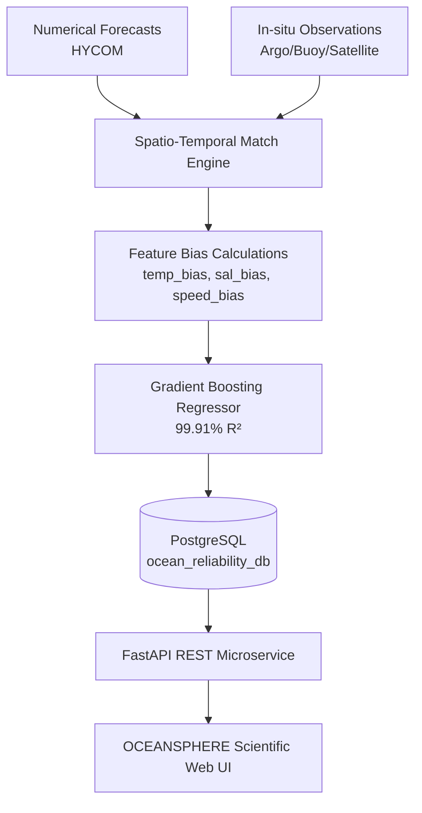

<div align="center">
  
  
  # 🌊 OCEANSPHERE
  
  **Ocean Forecast Reliability & Decision Support System**

  <p align="center">
    <a href="https://sih.gov.in/"></a>
    <a href="https://fastapi.tiangolo.com/"></a>
    <a href="https://www.postgresql.org/"></a>
    <a href="https://react.dev/"></a>
    <a href="https://www.typescriptlang.org/"></a>
  </p>
  
  *A world-class scientific web platform built for **INCOIS** (Indian National Centre for Ocean Information Services).*
</div>

---

## 🎯 About The Project

**OCEANSPHERE** evaluates numerical ocean model forecasts (HYCOM) against real-world in-situ observations (Argo floats, moored buoys, satellite SST/INCOIS) to compute machine-learning reliability scores, detect spatial anomalies, and deliver real-time marine decision support.

---

## ✨ Key Features

- 🌍 **Interactive 3D Earth Globe**: Full-screen 3D globe visualization with orbit controls, latitude & longitude mouse tracking, spatial region overlays, and layer controls.
- 🎨 **Dynamic Reliability Color Coding**:
  - 🟢 **Green (>80%)**: High Forecast Reliability *(Low Operational Risk)*
  - 🟡 **Yellow (60-80%)**: Moderate Reliability *(Moderate Divergence Risk)*
  - 🔴 **Red (<60%)**: Low Reliability *(Critical Anomaly Warning)*
- 🧠 **Machine Learning Pipeline**: Gradient Boosting Regressor achieving **99.91% R² accuracy** and **0.124 MAE** score validation.
- 📊 **9 Production Modules**: Home, Global 3D Globe, Forecast vs Observation Analysis, Reliability Dashboard, Alert Center, Region Intelligence, Model Analytics & Live Sandbox (`POST /predict`), Executive Reports Generator.
- ⚡ **Real-time 30-Second Polling**: Auto-refresh status indicators sync live PostgreSQL records and FastAPI predictions.

---

## 💻 Tech Stack

### Frontend
- **Framework**: React 18 with TypeScript
- **Styling**: Tailwind CSS
- **3D Visualization**: CesiumJS (Earth Globe)
- **Charts**: Recharts

### Backend
- **Framework**: FastAPI (Python 3.10+)
- **Machine Learning**: Scikit-learn (Gradient Boosting)
- **Database**: PostgreSQL / SQLite (Fallback)

---

## 🚀 Quick Start

### 1. Prerequisites
Ensure you have the following installed:
- [Python 3.10+](https://www.python.org/downloads/)
- [Node.js 18+](https://nodejs.org/) & npm
- [PostgreSQL](https://www.postgresql.org/) (optional for local dev if using SQLite)

### 2. Backend Setup
```bash
# Navigate to the backend directory
cd backend

# Install Python dependencies
pip install -r requirements.txt

# Start the FastAPI backend server
python -m uvicorn main:app --host 127.0.0.1 --port 8000 --reload
```
> **API Docs**: Available at `http://127.0.0.1:8000/docs`

### 3. Frontend Setup
```bash
# Open a new terminal and navigate to frontend
cd frontend

# Install Node dependencies
npm install

# Start the Vite development server
npm run dev
```
> **Web App**: Open `http://localhost:3000` in your browser.

---

## 🔬 Scientific Methodology & Data Pipeline



---

## 📂 Project Structure

<details>
<summary>Click to expand</summary>

```
OceanSphere/
├── frontend/             # React 18 + TypeScript + Vite + Tailwind + 3D Earth Globe
├── backend/              # FastAPI REST service & database connection module
├── datasets/             # Raw & cleaned HYCOM, Argo, Buoy, Satellite & INCOIS data
├── trained_models/       # Gradient Boosting .joblib model artifacts & metrics
├── reports/              # Daily, weekly & evaluation report exports
├── docs/                 # System architecture, API & database schema documentation
├── deployment/           # Docker, Cloud Run & Nginx reverse proxy configs
└── PROJECT_STRUCTURE.md  # Detailed directory architecture breakdown
```
</details>

---

## 📄 License
This project is licensed under the MIT License - see the [LICENSE](LICENSE) file for details.

<div align="center">
  <i>Built with ❤️ for SIH 2026</i>
</div>
